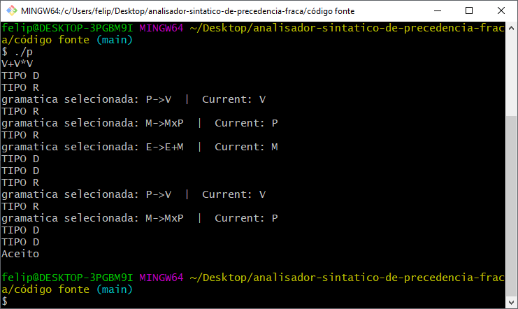
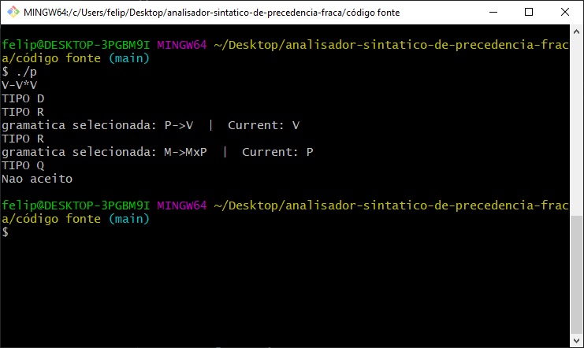

# ANALISADOR SINTÁTICO DE PRECEDENCIA FRACA

## GRAMÁTICA G':

* E -> E + M (ADIÇÃO COM RECURSÃO)
* E -> M     (FIM DA RECURSÃO DA ADIÇÃO)
* M -> M * P (MULTIPLICAÇÃO COM RECURSÃO) 
* M -> P     (FIM DA RECURSÃO DA MULTIPLICAÇÃO) 
* P -> (E)   (POSSIBILITA O USO DE PARENTESES) 
* P -> V     (TERMINAL)

## TESTE SINTÁTICO 1: V+V*V (  VÁLIDO  )

---

## TESTE SINTÁTICO 2: V-V*V (  NÃO VÁLIDO  )

